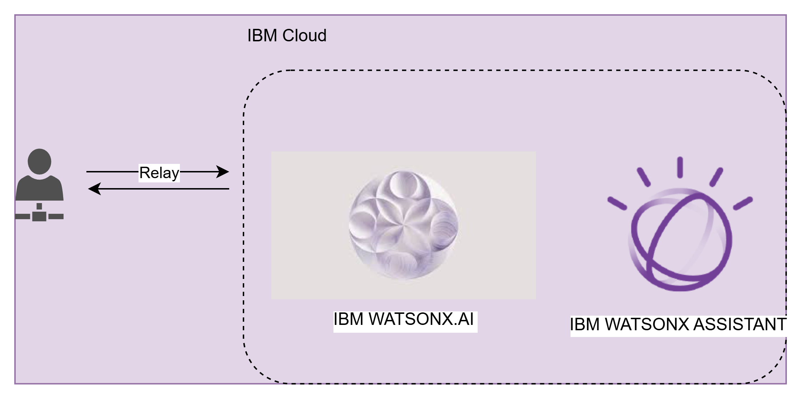
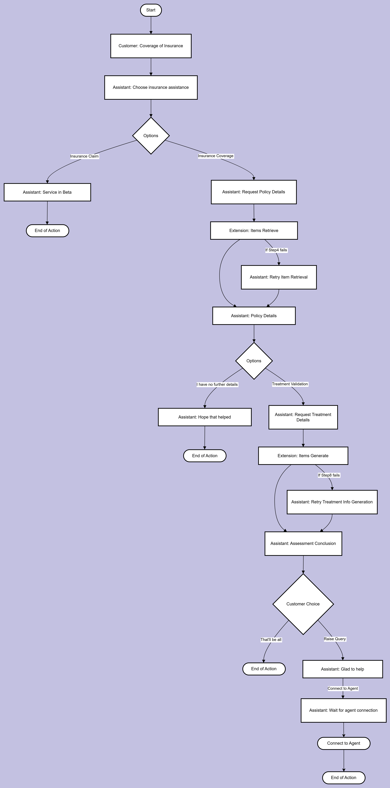

# Whitecoat-Tailors

Imagine being a doctor and a patient is sitting in front of you with doe eyes. You have seen such pair of eyes countless times, the chinese grandma just last week who needed treatment for cataracts, the young couple from india expecting their very first child and the war veterans who are illed spiritually and bodily. You a doctor know the right treatment, the right prescription, the right surgery and specialist but none of these are on the table because you are not sure if the patient can cover it.

Imagine a world where nurses and doctors spent 7 years of study to go into practise only to be told that your treatment might be financial poison for the patients. A healtcare worker should not have to decline, deliberate treatment wholely due to financial woes. This world of imagination is not an imagination but exists in USA, China and to some extent even praised systems such as Singapore.

Whitecoat Tailors aim to solve this by optimising insurance coverage interpretation and insurance claim process. Large language models presents an opportunity never available before, contextual awareness! Contextual understanding allow LLMs to do __`"Legal Talk"`__ on behalf of healthcare workers. Healthcare workers never have to guess if a treatment is covered under a policy, no longer have to fear and worry if insurance providers will __`"Lawyer"`__ away claim submissions.

## Solution:
An interactive chatbot released today for beta users and is easily integrable to any website. This solution used an entirely free google site to prove this point. Test the chatbot out at [Whitecoat Tailors](https://sites.google.com/view/whitecoat-tailor).

1 - User submit the policy terms and conditions (currently accepted modality is text but image and online searches will be availble in the future)

2 - Vision capable LLAMA-3.2-11b will interpret the contract terms and extract important details such as coverage and exclusions.

3 - Medical professional could then submit their treatment plan and the chatbot will use agentic reasoning to conclude if the treatment is covered by the insurance.

## Future plan:
Insurance claims workflow, using the same end-to-end capability of WATSONX to implement claim workflow, allowing medical workers to write and submit a highly legally aligned claim and reducing rejection.
## TechStack:
Fully reliant on Watsonx End to End solution, we implemented vision llama-3.2-11b model to interpret and process messages between users and watsonx backend.

## Current Bot Implementation:
